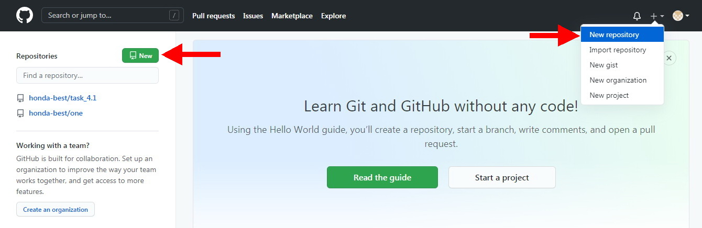

[<- К содержанию](./readme.md)

# Создание нового репозитория

Для этого нажмите кнопку _New_ или же воспользуйтесь выпадающим меню по кнопке ```+``` и выберите там *New repository*



После этого следуйте подсказкам, чтобы связать новый репозиторий со своим проектом

[**<- Назад |**](./registr.md "Как зарегистрироваться в GitHub") [**| Далее ->**](./download.md "Установка GIT на компьютер")