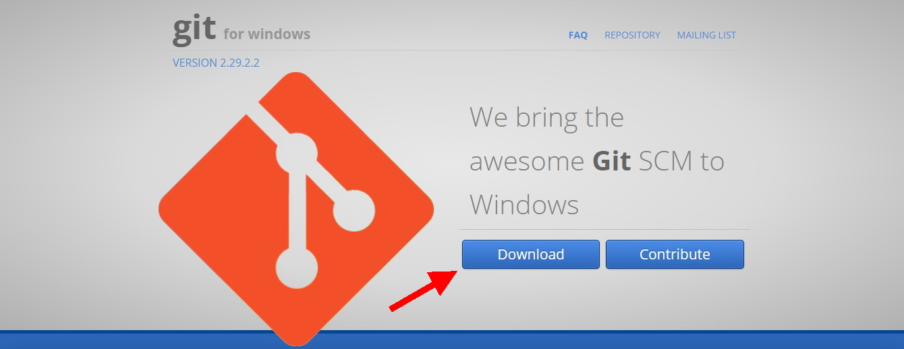

[<- К содержанию](./readme.md)

# Установка GIT на компьютер

Для того чтобы работать с GitHub, вам понадобится установленная программа на вашем компьютере. 

Если у вас установлена операционная система Windows, перейдите на сайт  [gitforwindows.org](https://gitforwindows.org "https://gitforwindows.org") и нажмите там кнопку **Download**. Загрузка начнется автоматически.

Если у вас компьютер с установленной Mac OS X, перейдите на сайт [git-scm.com](https://git-scm.com/download/mac "https://git-scm.com/download/mac") и следуйте дальнейшим инструкциям по загрузке и установке на данной странице.

[**<- Назад |**](./create.md "Создание нового репозитория") [**| Далее ->**](./set.md "Первая настройка GIT")