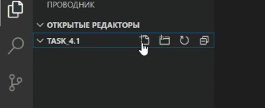

[<- К содержанию](./readme.md)

# Файл .gitignore

### Файл ***.gitignore*** - это текстовый файл, в который нужно поместить перечень шаблонов файловых имён, которые не должны отслеживаться при добавлении в репозиторий. 

Это могут быть файлы локальных настроек проекта, учётные данные, сведения об ошибках, библиотеки, промежуточные результаты компиляции и другие. Для создания файла используйте кнопку *New file* и укажите название файла как ***.gitignore***

Правила написания шаблонов в файле ***.gitignore***:

+ В одной строке должен быть только один шаблон.

+ Если в начале строки поставить символ _слэш_ `/ ` то правило применяется ТОЛЬКО к файлам и каталогам, которые располагаются в том же каталоге, что и сам файл .gitignore. 

+ Символ _звёздочка_ `*` заменяет собой любое количество символов.

+ Символ _знак вопроса_ `?` заменяет собой любой **один** символ.

+ _Две звёздочки_ `**` используются для указания любого количества подкаталогов при написании пути к игнорируемому файлу.

+ Символ _наклонная черта_ `\` используется для отделения спецсимволов.

+ Символ _слэш_ `/` используется для разделения уровня каталогов.

[**<- Назад |**](./first.md "Создание проекта")[**| Далее ->**](./terminal.md "Терминал")