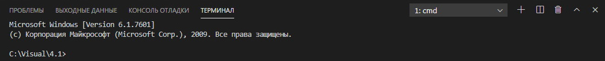

[<- К содержанию](./readme.md)

# Использование Терминала

Для написания команд для _Git_ используется командная строка. Для того, чтоб её открыть в *VSCode*, нажмите кнопку **Терминал** и в выпадающем меню выберите **Создать треминал**. Внизу появится окно терминала.

[**<- Назад |**](./ignore.md "Файл .gitignore")[**Далее ->**](./add.md "add")